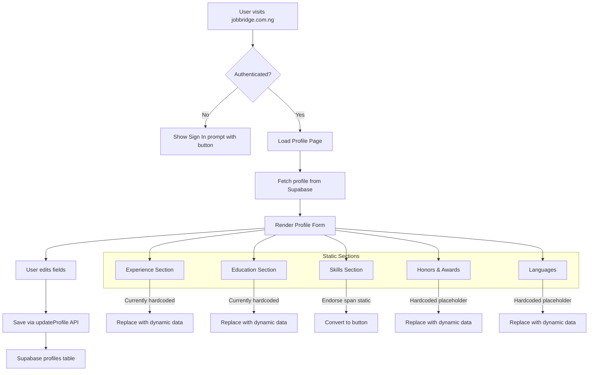

# Profile Page Audit & Fix Plan

## Overview

Audit the Profile page (`src/pages/Profile.tsx`) for non-functional buttons, static content, and broken inputs. Then fix all issues and ensure changes are deployed live to `jobbridge.com.ng`.

---

## 1. Current State Analysis

### File Under Review
- [`src/pages/Profile.tsx`](src/pages/Profile.tsx) — 1023 lines, well-structured React component

### Deployment Pipeline
- **Primary**: GitHub Actions workflow (`.github/workflows/deploy.yml`) deploys to GitHub Pages on push to `main`
- **Secondary**: `vercel.json` exists, but workflow targets GitHub Pages
- **Build command**: `npm run build` (Vite build + copy admin assets)

---

## 2. Button Audit (All Buttons in Profile Page)

| # | Button | Location (Line) | Action | Status |
|---|--------|----------------|--------|--------|
| 1 | Sign in to continue | 581-586 | `navigate('/login?redirect=...')` | ✅ Functional |
| 2 | Avatar (camera overlay) | 618-639 | `openAvatarPicker` → file input click | ✅ Functional |
| 3 | View jobs | 672-678 | `navigate('/jobs')` + toast | ✅ Functional |
| 4 | Explore providers | 679-685 | `navigate('/providers')` + toast | ✅ Functional |
| 5 | Edit profile | 686-692 | `scrollToSection('editor')` | ✅ Functional |
| 6 | Security | 693-699 | `scrollToSection('security')` | ✅ Functional |
| 7 | Enable/Disable Notifications | 748-754 | `subscribeToPush/unsubscribeFromPush` | ✅ Functional |
| 8 | Reset (profile editor) | 791-797 | `handleReset` → restore initial form | ✅ Functional |
| 9 | Save changes (profile editor) | 798-814 | `handleSave` → `updateProfile` | ✅ Functional |
| 10 | Reset changes (bottom) | 877-883 | `handleReset` → restore initial form | ✅ Functional |
| 11 | Save profile (bottom) | 884-900 | `handleSave` → `updateProfile` | ✅ Functional |
| 12 | Change password | 948-964 | `handlePasswordChange` → `updatePassword` | ✅ Functional |

**All buttons have proper handlers wired up.** No non-functional buttons found in terms of missing onClick handlers.

---

## 3. Input Fields Audit

| # | Field | Type | Location | Status |
|---|-------|------|----------|--------|
| 1 | Full Name | text input | renderFormField | ✅ Functional |
| 2 | Phone Number | tel input | renderFormField | ✅ Functional |
| 3 | Location | text input | renderFormField | ✅ Functional |
| 4 | Professional Headline | text input | renderFormField | ✅ Functional |
| 5 | Years of Experience | number input | renderFormField | ✅ Functional |
| 6 | Bio / About | textarea | renderFormField | ✅ Functional |
| 7 | Service Specialty | select | renderFormField | ✅ Functional |
| 8 | Hourly Rate | number input | renderFormField | ✅ Functional |
| 9 | Skills | text input | renderFormField | ✅ Functional |
| 10 | Email | text (readonly) | renderFormField | ✅ Functional |
| 11 | New Password | password input | line 927-933 | ✅ Functional |
| 12 | Confirm Password | password input | line 937-943 | ✅ Functional |
| 13 | Avatar file | file input | line 601-607 | ✅ Functional |

**All input fields are wired up with proper onChange handlers and state updates.**

---

## 4. Static / Placeholder Content Issues

These sections display hardcoded placeholder data that should either be dynamic or provide interactive edit capabilities:

| # | Section | Lines | Issue | Severity |
|---|---------|-------|-------|----------|
| 1 | **Connections count** | 663 | Hardcoded `3,245` — should be dynamic from profile/backend | Medium |
| 2 | **Profile views** | 715 | Hardcoded `128 times in the last 14 days` | Medium |
| 3 | **Top match** | 719 | Hardcoded `top 10%` | Medium |
| 4 | **Experience section** | 724-742 | Hardcoded "Creative Director", "SEO Specialist" with "The Company Media Office" | High |
| 5 | **Education section** | 968-978 | Hardcoded "Lorem University", "Master of Art" | High |
| 6 | **Skills - "Endorse" span** | 987 | `` not a `<button>` — completely non-interactive | High |
| 7 | **Honors & awards** | 995-1004 | Hardcoded "Gold Winner" placeholder | High |
| 8 | **Languages** | 1006-1014 | Hardcoded "English" placeholder | High |

---

## 5. Detailed Fix Plan

### Step 5.1: Fix Interactive Elements
**Location**: [`src/pages/Profile.tsx:987`](src/pages/Profile.tsx:987)

**Issue**: The "Endorse" element in the Skills section is a `` that does nothing when clicked.

**Fix**: Convert to a proper `<button>` with an `onClick` handler that triggers an endorse flow (or at minimum shows a toast indicating the feature is coming). If no backend endorse endpoint exists, wire it to a toast notification.

### Step 5.2: Replace Static Placeholder Data with Dynamic Content

**A. Connections Count** (line 663)
- Replace hardcoded `3,245` with a dynamic value from the profile/user data
- If not available from backend, derive from `userProfile` or set to `0` as fallback

**B. Profile Views & Top Match Stats** (lines 715, 719)
- These are static and should ideally come from an analytics/metrics endpoint
- Since the code references [`src/lib/abMetrics.ts`](src/lib/abMetrics.ts) and [`src/lib/paymentMetrics.ts`](src/lib/paymentMetrics.ts), check if profile metrics exist
- If no backend data available, keep as static but add a note/issue tracking

**C. Experience Section** (lines 724-742)
- Replace hardcoded entries with data from the `profiles` table or a new `experiences` table
- If no backend field exists for experience entries, implement inline editable experience items or show a "Coming soon" prompt with add functionality

**D. Education Section** (lines 968-978)
- Same approach as Experience — replace "Lorem University" with real data or editable UI

**E. Skills - Endorse Button** (line 987)
- Convert `Endorse` to `<button onClick={...}>Endorse</button>`
- Handler can show a toast or call an endorse API

**F. Honors & Awards** (lines 995-1004)
- Replace with dynamic data or interactive add/edit UI

**G. Languages** (lines 1006-1014)
- Replace with dynamic data or interactive add/edit UI

### Step 5.3: Deployment Fix

**Current State**: 
- GitHub Actions workflow at [`.github/workflows/deploy.yml`](.github/workflows/deploy.yml) deploys to GitHub Pages on push to `main`
- `vercel.json` exists with config but no Vercel deploy workflow
- `railway.json` references a `server` directory that doesn't exist

**Fix**:
1. Confirm the deployment target (GitHub Pages vs Vercel vs Railway)
2. Ensure the GitHub Actions workflow has the necessary env vars (VITE_SUPABASE_URL, VITE_SUPABASE_ANON_KEY, VITE_KORA_PUBLIC_KEY) — currently they're commented out
3. Add environment variable configuration to the workflow so the build uses correct production values
4. Verify the domain `jobbridge.com.ng` is set up in GitHub Pages settings (custom domain)

---

## 6. Architecture Diagram

---

## 7. Execution Steps (Ordered)

1. **Fix Skills "Endorse" button** — Convert `` to `<button>` with click handler
2. **Fix Connections count** — Replace hardcoded number with dynamic value from profile or user data
3. **Fix Profile views & Top match stats** — Either source from backend or add feature-request note
4. **Fix Experience section** — Make dynamic or add editable UI; remove hardcoded placeholders
5. **Fix Education section** — Make dynamic or add editable UI; remove "Lorem University"
6. **Fix Honors & Awards** — Make dynamic or add editable UI
7. **Fix Languages** — Make dynamic or add editable UI
8. **Fix Deployment** — Ensure GitHub Actions workflow has proper env vars; verify custom domain setup
9. **Commit and push to `main`** — Trigger GitHub Pages deployment

---

## 8. Environment Variables Needed for Build

| Variable | Source | Required for |
|----------|--------|-------------|
| `VITE_SUPABASE_URL` | Supabase project settings | API calls |
| `VITE_SUPABASE_ANON_KEY` | Supabase project settings | API calls |
| `VITE_KORA_PUBLIC_KEY` | KoraPay dashboard | Payments |
| `VITE_SUPABASE_FUNCTIONS_URL` | Supabase project settings | Edge functions |
| `VITE_VAPID_PUBLIC_KEY` | Web push setup | Push notifications |

These should be set as **GitHub Actions secrets** and passed to the build step in the workflow.
